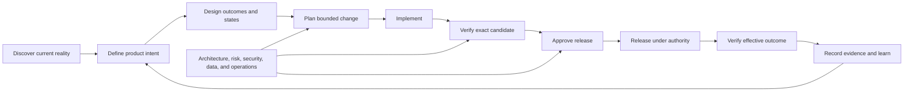

# AI Ready

AI Ready is a documentation-first, language-neutral framework for turning software repositories into controlled environments for artificial intelligence (AI)-assisted development and evidence-based release decisions.

It gives people and AI agents a shared operating model for discovering an unfamiliar or legacy system, reconstructing product intent, defining safe authority, planning changes, validating implementation, and proving that an exact release candidate is ready. The framework is reusable Markdown, not an executable tool or a prescribed repository layout.

## Why it exists

AI can inspect and change code quickly, but speed is not assurance. Reliable delivery also requires product intent, user and design context, architecture boundaries, reproducible environments, traceability, testing, security, operations, release authority, and durable evidence.

AI Ready connects those responsibilities without pretending that a document, checklist, model, or passing build can replace accountable review.

Use it to answer:

- What is this system meant to do, for whom, and under which constraints?
- Which behaviour is intended, observed, assumed, missing, or unsafe?
- What may an AI agent read, change, execute, or operate?
- Which source, generated, data, infrastructure, and repository boundaries must be preserved?
- How does each requirement trace to a feature, implementation, verification result, and release?
- What evidence proves that the exact candidate works in the relevant environments?
- Who can accept risk, approve a release, execute it, and respond if it fails?

## Start here

Choose the path that matches the current project state. They may converge on the same records; they do not require copying the entire framework.

### Unfamiliar or legacy project

1. Follow the [legacy-project playbook](docs/guidance/legacy-project-playbook.md).
2. Record facts, evidence, unknowns, and unsafe assumptions in the [discovery and baseline record](docs/boilerplate/DISCOVERY_AND_BASELINE.md).
3. Complete the [adoption map](docs/boilerplate/ADOPTION_MAP.md) before creating or moving documents.
4. Assess permitted AI use with the [AI coding-readiness assessment](docs/AiReady.md).
5. Remediate blockers through small, supervised, reversible changes before expanding AI authority.

### Project with established delivery controls

1. Map existing authoritative records with the [adoption map](docs/boilerplate/ADOPTION_MAP.md).
2. Use the [assessment](docs/AiReady.md) to test whether those controls are effective for the intended AI operating level.
3. Adapt only the templates needed to close evidenced gaps.
4. Preserve existing tools and locations where they remain authoritative.

### Feature or release already in progress

1. Define the bounded change with the [AI-assisted task record](docs/boilerplate/AI_TASK.md).
2. Connect requirements, design, implementation, tests, risks, and release scope through [traceability](docs/boilerplate/TRACEABILITY.md).
3. Preserve phase or milestone evidence in an optional [delivery checkpoint](docs/boilerplate/DELIVERY_CHECKPOINT.md) when useful; it does not grant release authority.
4. Qualify the exact candidate through the [release process](docs/boilerplate/RELEASE_PROCESS.md) and [readiness record](docs/boilerplate/RELEASE_READINESS.md).
5. Preserve the decision and actual result in an immutable [release evidence record](docs/releases/RELEASE_EVIDENCE_TEMPLATE.md).

## Operating model

The framework deliberately keeps these states separate:

- **intended:** approved product or operational behaviour;
- **implemented:** code or configuration exists;
- **verified:** defined evidence passed for named commits, artefacts, data, and environments;
- **approved:** an authorised person accepted the exact candidate and residual risk; and
- **released:** approved artefacts were distributed or deployed and effective-environment checks passed.

One state never implies another.

## Responsibility coverage

AI Ready treats delivery as a set of accountable responsibilities rather than job titles. One person may cover several responsibilities, and an AI agent may perform authorised work within them, but the agent cannot approve its own output or accept risk.

| Responsibility | Required outcome | Primary records |
| --- | --- | --- |
| Product and service ownership | Evidence-based problem, users, outcomes, scope, priorities, and claims | [Product brief](docs/product/PRODUCT_BRIEF_TEMPLATE.md), [requirements](docs/product/PRODUCT_REQUIREMENTS_TEMPLATE.md), [roadmap](docs/boilerplate/ROADMAP.md) |
| Research, experience, content, and design | Usable journeys, states, content, accessibility, design decisions, and evaluation | [Experience and design](docs/product/EXPERIENCE_AND_DESIGN_TEMPLATE.md), [accessibility](docs/product/ACCESSIBILITY_AND_INCLUSIVE_DESIGN_ADDENDUM_TEMPLATE.md), [brand and messaging](docs/product/BRAND_AND_MESSAGING_TEMPLATE.md) |
| Engineering and architecture | Maintainable implementation, controlled boundaries, decisions, compatibility, and traceability | [Architecture](docs/boilerplate/ARCHITECTURE.md), [feature record](docs/boilerplate/FEATURE_RECORD.md), [decision record](docs/boilerplate/DECISION_RECORD.md) |
| Security, privacy, compliance, and data | Known threats and obligations, least privilege, safe data use, verified controls, and bounded claims | [Security policy](docs/boilerplate/SECURITY_POLICY.md), [risk register](docs/boilerplate/RISK_REGISTER.md), [optional compliance records](docs/compliance/README.md), [readiness assessment](docs/AiReady.md) |
| Quality assurance | Risk-based coverage, reproducible checks, manual evaluation, defects, and evidence | [Testing contract](docs/boilerplate/TESTING.md), [verification plan](docs/boilerplate/VERIFICATION_PLAN.md), [traceability](docs/boilerplate/TRACEABILITY.md) |
| Operations and reliability | Deployability, observability, capacity, support, backup, recovery, and effective verification | [Operations and recovery](docs/boilerplate/OPERATIONS_AND_RECOVERY.md), [operational quality](docs/product/ARCHITECTURE_AND_OPERATIONAL_QUALITY_ADDENDUM_TEMPLATE.md) |
| Release authority | Candidate integrity, gate decisions, residual-risk acceptance, execution, and closure | [Release checklist](docs/boilerplate/RELEASE_CHECKLIST.md), [release readiness](docs/boilerplate/RELEASE_READINESS.md), [release evidence](docs/releases/RELEASE_EVIDENCE_TEMPLATE.md) |

See [roles and decision rights](docs/guidance/roles-and-decision-rights.md) for the complete responsibility and approval model.

## Core principles

- **Evidence over assertion:** file presence, a completed checkbox, generated output, or a passing unit test is not proof beyond its actual scope.
- **Outcomes over generated volume:** measure progress through approved outcomes, understandable and maintainable changes, verified features, safe operations, and released value—not tokens, lines of code, or agent activity.
- **Current reality before redesign:** preserve observed legacy behaviour and uncertainty until owners decide what should change.
- **One source of truth:** map existing authoritative systems before adding documentation.
- **Applicability before compliance work:** do not assume a law, standard, audit, certification, or policy applies; select it from current evidence and accountable review.
- **Ordered authoritative context:** tell people and AI what to read, which source prevails, and when a conflict requires escalation.
- **Least authority:** separate reading, editing, executing, communicating, deploying, migrating, deleting, and spending.
- **Untrusted AI output:** validate generated code, commands, queries, configuration, markup, URLs, dependencies, and claims before use.
- **Govern material AI inputs:** control prompts, evaluations, tools, model versions, and configurations that affect behaviour with proportionate traceability, testing, data protection, review, and change management.
- **Exact candidate identity:** evidence and approval bind to immutable commits and artefacts, not moving branches or intended builds.
- **System-level verification:** interconnected repositories are ready only when supported combinations, contracts, sequencing, and partial-failure recovery are verified.
- **Human accountability:** named people own requirements, exceptions, risk acceptance, release approval, and production authority.
- **Effective-environment proof:** source and pipeline success do not prove deployed, rendered, distributed, or user-observed behaviour.
- **No evidence-level substitution:** simulated, component, packaged, integrated, representative, physical, specialist, and effective-environment results establish different claims.
- **Learning closes the loop:** incidents, deviations, feedback, and stale evidence update requirements and controls.

## Framework records

| Record group | Purpose |
| --- | --- |
| [Assessment](docs/AiReady.md) | Determines the maximum permitted AI operating level from current control evidence and hard blockers. |
| [Guidance](docs/README.md#guidance) | Explains adoption, legacy discovery, responsibilities, evidence, lifecycle, and assessment methodology. |
| [General boilerplate](docs/boilerplate/README.md) | Covers project definition, AI instructions, delivery, architecture, verification, risk, operations, and readiness. |
| [Product documents](docs/product/README.md) | Covers product intent, requirements, design, accessibility, quality attributes, and evidence-bounded messaging. |
| [Accessibility checklists](docs/accessibility/README.md) | Optional W3C-based website, mobile application, WCAG result, and jurisdiction-selection records. |
| [Compliance-readiness checklists](docs/compliance/README.md) | Optional applicability-first security, privacy, assurance, AI, financial-crime, supply-chain, and jurisdiction records without implying certification or legal approval. |
| [Release evidence](docs/releases/README.md) | Records exact candidates, approvals, execution, effective results, failures, rollback, and closure. |

Template names and locations are examples within this repository. An adopting project may use existing issues, wikis, documents, service-management systems, pipelines, or release platforms as its authoritative records.

## What completion means

A project is not AI-ready because it copied these files. It is ready for a stated operating level only when:

- every applicable concern has an authoritative owner and source;
- hard blockers are resolved for the authorised activity;
- instructions and permissions match the intended AI use;
- build and verification are reproducible from a clean environment;
- requirements, design decisions, changes, risks, tests, and releases are traceable;
- manual and effective-environment evaluation covers what automation cannot;
- multi-repository dependencies are verified as an effective system;
- recovery and incident responses are tested to the required level; and
- accountable people approve current evidence and residual risk.

The [methodology](docs/guidance/methodology.md) defines scoring and evidence rules. AI Ready is not a security certification, accessibility-conformance claim, regulatory approval, or guarantee of software quality.

## Repository map

- [`docs/`](docs/README.md): framework index and governance documents.
- [`docs/guidance/`](docs/guidance/adoption.md): adoption and operating guidance.
- [`docs/boilerplate/`](docs/boilerplate/README.md): project-neutral working records.
- [`docs/product/`](docs/product/README.md): product, experience, design, and quality records.
- [`docs/accessibility/`](docs/accessibility/README.md): optional website, mobile application, WCAG, and jurisdiction accessibility checklists.
- [`docs/compliance/`](docs/compliance/README.md): optional applicability, obligation, control, evidence, framework-readiness, and claims checklists.
- [`docs/releases/`](docs/releases/README.md): immutable release-evidence records.
- [`.github/`](.github): issue forms, pull-request template, ownership, dependency updates, and documentation checks for AI Ready itself.

## Project health and participation

- [Contributing](docs/CONTRIBUTING.md)
- [Support](docs/SUPPORT.md)
- [Security policy](docs/SECURITY.md)
- [Governance](docs/GOVERNANCE.md)
- [Code of Conduct](docs/CODE_OF_CONDUCT.md)
- [Changelog](docs/CHANGELOG.md)

GitHub Actions checks Markdown formatting and internal links. Those structural checks protect this repository's documentation quality; they do not assess an adopting project's readiness.

## Licence

Licensed under the [Apache License 2.0](LICENSE).
