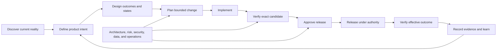

# AiReady

AiReady helps people and artificial intelligence (AI) understand what a
software system should do, where its important information lives, what may be
safely changed, and how to prove that a change works.

It is a documentation-first, language-neutral framework for controlled
AI-assisted development and evidence-based release decisions. It can be
applied to an unfamiliar legacy system, an established project, or a change
already in progress. AiReady is reusable Markdown, not executable software and
not a prescribed repository layout.

## Why it exists

AI can inspect and change code quickly, but speed is not assurance. Reliable delivery also requires product intent, user and design context, architecture boundaries, reproducible environments, traceability, testing, security, operations, release authority, and durable evidence.

AiReady connects those responsibilities without pretending that a document, checklist, model, or passing build can replace accountable review.

Use it to answer:

- What is this system meant to do, for whom, and under which constraints?
- Which behaviour is intended, observed, assumed, missing, or unsafe?
- What may an AI agent read, change, execute, or operate?
- Can the AI access every current authoritative requirement applicable to its work, including requirements confirmed during discovery, while retaining newly identified but unconfirmed requirements as blocking unknowns?
- Which source, generated, data, infrastructure, and repository boundaries must be preserved?
- What is the minimum sufficient authoritative context for this change, and where could ambiguity or high-impact relationships expand its scope?
- Can an unfamiliar AI agent demonstrate that it can locate the right implementation, bound the impact, and reach actionable verification from the project's normal starting material?
- How does each requirement trace from its source through design, risk,
  implementation, verification, validation, and release?
- Which focused check provides fast, deterministic feedback, and what higher-level verification must still follow?
- What evidence proves that the exact candidate works in the relevant environments?
- Who can accept risk, approve a release, execute it, and respond if it fails?

## How it works

1. **Discover current reality:** establish the exact system boundary, existing
   behaviour, authoritative sources, dependencies, controls, evidence, and
   unknowns before changing anything.
2. **Establish intent and authority:** confirm what should be built, what the AI
   may read or do, which source prevails, and where a person must decide.
3. **Make a bounded change:** connect the task to its requirements,
   architecture, dependencies, risks, acceptance criteria, and safe change
   boundary.
4. **Verify the exact result:** use fast deterministic checks and every required
   higher-level, human, specialist, integrated, and effective-environment
   evaluation.
5. **Preserve evidence and learn:** bind evidence and approval to the exact
   candidate, record the actual outcome, and feed incidents, deviations, and
   discoveries back into the authoritative sources.

In short:

> Discover reality -> establish authoritative context -> make a bounded change
> -> verify the exact result -> preserve evidence and learn.

## Why this helps AI deliver better code

An AI agent can generate code quickly, but it does not automatically know which
requirement is current, why an architectural choice was made, what another
repository depends on, or which test establishes the required behaviour. A
larger context window provides capacity; it does not establish authority,
currency, relevance, completeness, or truth.

AiReady improves the engineering environment around the agent:

| Mechanism | Practical effect |
| --- | --- |
| Ordered, minimum sufficient authoritative context | Increases useful information per token and reduces repeated discovery, stale-source selection, and conflicting instructions |
| Explicit requirements, decisions, invariants, non-goals, and unknowns | Narrows the valid solution space and makes unsafe guessing or missing authority visible |
| Canonical patterns, architecture boundaries, and dependency maps | Reduces locally plausible changes that are inconsistent with the wider system |
| Bounded tasks, permissions, and stop conditions | Limits unintended effects and routes material judgment to accountable people |
| Fast deterministic feedback followed by proportionate higher-level verification | Converts plausible output into reproducible evidence without treating one test level as proof of another |
| Fresh-context probes and retained results | Tests whether an unfamiliar agent can actually navigate, assess impact, and verify work instead of inferring readiness from document presence |

AiReady does not make an AI model intrinsically smarter or guarantee good code.
It makes the problem more legible, constrained, testable, and reviewable. Judge
the result by delivered, understood, maintainable, and verified outcomes--not
by generated tokens, accepted suggestions, or lines of code.

### Example: an unfamiliar legacy service

A developer asks an AI agent to change how a legacy service calculates a
customer charge. The agent can find the calculation code, but that alone does
not reveal whether the current behaviour is intentional, which contract
defines it, which other repositories consume it, or which tests prove the
customer outcome.

Using AiReady, the team first identifies the authoritative requirement,
observed behaviour, owning component, dependent interfaces, accepted change
boundary, and verification path. If a material requirement is missing or
inaccessible, the AI stops. Once the intended change is confirmed, the agent
works within a bounded task, runs the approved checks, and returns evidence for
human review. The value comes from fewer unsupported assumptions and stronger
verification--not merely faster code generation.

### Related perspective

> “Tokens are to software as bricks are to architecture:”
>
> -- Francesco Gadaleta, *The Mythical Token-Month*

This brief excerpt captures why AiReady measures engineering outcomes rather
than generation volume. The book also examines context reconstruction,
conceptual integrity, evaluation, dependency risk, and human judgment in
AI-assisted software development. [Learn more about or purchase *The Mythical
Token-Month*](https://mythicaltokenmonth.com/).

AiReady is an independent project and is not affiliated with or endorsed by
the author. Copyright in the quotation remains with Francesco Gadaleta; it is
not licensed under AiReady's Apache License 2.0. See the [research and further
reading guide](docs/guidance/research-and-further-reading.md) for independent
peer-reviewed research, established engineering references, scope, and
limitations.

## Start here

Choose the path that matches the current project state. They may converge on the same records; they do not require copying the entire framework.

### Unfamiliar or legacy project

1. Follow the [legacy-project playbook](docs/guidance/legacy-project-playbook.md).
2. Record facts, evidence, unknowns, and unsafe assumptions in the [discovery and baseline record](docs/boilerplate/DISCOVERY_AND_BASELINE.md).
3. Use fresh-context AI probes to test mechanical comprehension and agent efficiency for representative change classes.
4. Complete the [adoption map](docs/boilerplate/ADOPTION_MAP.md) before creating or moving documents.
5. Assess permitted AI use with the [AI coding-readiness assessment](docs/AiReady.md).
6. Remediate blockers through small, supervised, reversible changes before expanding AI authority.

### Project with established delivery controls

1. Map existing authoritative records with the [adoption map](docs/boilerplate/ADOPTION_MAP.md).
2. Use the [assessment](docs/AiReady.md) to test whether those controls are effective for the intended AI operating level.
3. Adapt only the templates needed to close evidenced gaps.
4. Preserve existing tools and locations where they remain authoritative.

### Feature or release already in progress

1. Define the bounded change with the [AI-assisted task record](docs/boilerplate/AI_TASK.md).
2. Connect requirements, design, implementation, tests, risks, and release scope through [traceability](docs/boilerplate/TRACEABILITY.md).
3. Preserve phase or milestone evidence in an optional [delivery checkpoint](docs/boilerplate/DELIVERY_CHECKPOINT.md) when useful; it does not grant release authority.
4. Qualify the exact candidate through the [release process](docs/boilerplate/RELEASE_PROCESS.md) and [readiness record](docs/boilerplate/RELEASE_READINESS.md).
5. Preserve the decision and actual result in an immutable [release evidence record](docs/releases/RELEASE_EVIDENCE_TEMPLATE.md).

## Use an AI assistant to implement the framework

An AI assistant can accelerate adoption by discovering the current project,
mapping existing controls, gathering evidence, identifying gaps, drafting
approved updates, and running permitted checks. It should implement AiReady
around the way the project already works--not copy every template, reorganise
the repository, or invent process for its own sake.

Start read-only against exact repository states. Define the system boundary,
permitted data and actions, prohibited operations, accountable owner, and human
reviewer before granting edit or execution authority. An AI can gather and test
evidence; people remain responsible for requirements, source precedence, risk
acceptance, approval, release, and production authority.

Use the [AI adoption guide and reusable prompts](docs/guidance/using-ai-to-adopt-aiready.md)
for a controlled discovery assessment followed by a separately authorised,
bounded implementation. Review the result before expanding authority.

## Operating model

The framework deliberately keeps these states separate:

- **intended:** approved product or operational behaviour;
- **implemented:** code or configuration exists;
- **verified:** defined evidence passed for named commits, artefacts, data, and environments;
- **approved:** an authorised person accepted the exact candidate and residual risk; and
- **released:** approved artefacts were distributed or deployed and effective-environment checks passed.

One state never implies another.

## Responsibility coverage

AiReady treats delivery as a set of accountable responsibilities rather than job titles. One person may cover several responsibilities, and an AI agent may perform authorised work within them, but the agent cannot approve its own output or accept risk.

| Responsibility | Required outcome | Primary records |
| --- | --- | --- |
| Product and service ownership | Evidence-based problem, users, outcomes, scope, priorities, and claims | [Product brief](docs/product/PRODUCT_BRIEF_TEMPLATE.md), [requirements](docs/product/PRODUCT_REQUIREMENTS_TEMPLATE.md), [roadmap](docs/boilerplate/ROADMAP.md) |
| Research, experience, content, and design | Usable journeys, states, content, accessibility, design decisions, and evaluation | [Experience and design](docs/product/EXPERIENCE_AND_DESIGN_TEMPLATE.md), [accessibility](docs/product/ACCESSIBILITY_AND_INCLUSIVE_DESIGN_ADDENDUM_TEMPLATE.md), [brand and messaging](docs/product/BRAND_AND_MESSAGING_TEMPLATE.md) |
| Engineering and architecture | Maintainable implementation, controlled boundaries, stakeholder views, trade-offs, decisions, compatibility, and traceability | [Architecture](docs/boilerplate/ARCHITECTURE.md), [optional architecture review](docs/boilerplate/ARCHITECTURE_REVIEW.md), [feature record](docs/boilerplate/FEATURE_RECORD.md), [decision record](docs/boilerplate/DECISION_RECORD.md) |
| Security, privacy, compliance, and data | Known threats and obligations, least privilege, safe data use, verified controls, and bounded claims | [Security policy](docs/boilerplate/SECURITY_POLICY.md), [risk register](docs/boilerplate/RISK_REGISTER.md), [optional compliance records](docs/compliance/README.md), [readiness assessment](docs/AiReady.md) |
| Quality assurance | Risk-based verification and validation, reproducible checks, manual evaluation, defects, completion criteria, and evidence | [Testing contract](docs/boilerplate/TESTING.md), [optional AI-system evaluation](docs/boilerplate/AI_SYSTEM_EVALUATION.md), [verification plan](docs/boilerplate/VERIFICATION_PLAN.md), [traceability](docs/boilerplate/TRACEABILITY.md) |
| Operations, reliability, and technology value | Deployability, observability, failure exercises, capacity, cost/value, resource efficiency, sustainability, support, backup, recovery, and effective verification | [Operations and recovery](docs/boilerplate/OPERATIONS_AND_RECOVERY.md), [technology cost and value](docs/boilerplate/TECHNOLOGY_COST_AND_VALUE.md), [operational quality](docs/product/ARCHITECTURE_AND_OPERATIONAL_QUALITY_ADDENDUM_TEMPLATE.md) |
| Release authority | Candidate integrity, gate decisions, residual-risk acceptance, execution, and closure | [Release checklist](docs/boilerplate/RELEASE_CHECKLIST.md), [release readiness](docs/boilerplate/RELEASE_READINESS.md), [release evidence](docs/releases/RELEASE_EVIDENCE_TEMPLATE.md) |

See [roles and decision rights](docs/guidance/roles-and-decision-rights.md) for the complete responsibility and approval model.

## Core principles

- **Evidence over assertion:** file presence, a completed checkbox, generated output, or a passing unit test is not proof beyond its actual scope.
- **Outcomes over generated volume:** measure progress through approved outcomes, understandable and maintainable changes, verified features, safe operations, and released value—not tokens, lines of code, or agent activity.
- **Current reality before redesign:** preserve observed legacy behaviour and uncertainty until owners decide what should change.
- **One source of truth:** map existing authoritative systems before adding documentation.
- **Applicability before compliance work:** do not assume a law, standard, audit, certification, or policy applies; select it from current evidence and accountable review.
- **Ordered authoritative context:** tell people and AI what to read, which source prevails, and when a conflict requires escalation.
- **Bounded context without prescribed layout:** identify the minimum sufficient context, canonical patterns, ambiguity, and high-impact relationships for a change without imposing universal directories, file sizes, or dependency-depth limits.
- **Fast feedback without evidence substitution:** provide focused, deterministic checks with actionable diagnostics, then complete every required higher-level and effective-environment verification.
- **Least authority:** separate reading, editing, executing, communicating, deploying, migrating, deleting, and spending.
- **Architecture as an evidence-led lifecycle:** keep stakeholder concerns, current baseline, target state, transition work, cross-quality trade-offs, and improvement actions explicit.
- **Value and resource stewardship:** assess reliability, performance/capacity, technology cost/value, and sustainability separately; bound billable work and verify cleanup.
- **Untrusted AI output:** validate generated code, commands, queries, configuration, markup, URLs, dependencies, and claims before use.
- **Govern material AI inputs:** control prompts, evaluations, tools, model versions, and configurations that affect behaviour with proportionate traceability, testing, data protection, review, and change management.
- **Exact candidate identity:** evidence and approval bind to immutable commits and artefacts, not moving branches or intended builds.
- **Producer evidence requires consumer verification:** provenance,
  attestations, signatures, manifests, and software bills of materials establish
  only their supported claims after the exact subject and asserted properties
  pass an approved trust and verification policy.
- **System-level verification:** interconnected repositories are ready only when supported combinations, contracts, sequencing, and partial-failure recovery are verified.
- **Human accountability:** named people own requirements, exceptions, risk acceptance, release approval, and production authority.
- **Effective-environment proof:** source and pipeline success do not prove deployed, rendered, distributed, or user-observed behaviour.
- **No evidence-level substitution:** simulated, component, packaged, integrated, representative, physical, specialist, and effective-environment results establish different claims.
- **Learning closes the loop:** incidents, deviations, feedback, and stale evidence update requirements and controls.
- **Control-level readiness history:** compare evidence, blockers, and individual controls over time; an aggregate score is a summary, not an automatic approval or release gate.

## Framework records

| Record group | Purpose |
| --- | --- |
| [Assessment](docs/AiReady.md) | Determines the maximum permitted AI operating level from current control evidence and hard blockers. |
| [Guidance](docs/README.md#guidance) | Explains adoption, AI-assisted implementation, legacy discovery, responsibilities, evidence, lifecycle, assessment methodology, and research foundations. |
| [General boilerplate](docs/boilerplate/README.md) | Covers project definition, AI instructions, delivery, architecture and optional review, verification, optional AI-system evaluation, technology cost/value, risk, operations, and readiness. |
| [Product documents](docs/product/README.md) | Covers product intent, requirements, design, accessibility, quality attributes, and evidence-bounded messaging. |
| [Accessibility checklists](docs/accessibility/README.md) | Optional W3C-based website, mobile application, WCAG result, and jurisdiction-selection records. |
| [Compliance-readiness checklists](docs/compliance/README.md) | Optional applicability-first security, National Institute of Standards and Technology Cybersecurity Framework (NIST CSF), privacy, assurance, AI, financial-crime, software supply-chain, Supply-chain Levels for Software Artifacts (SLSA), open-source security, and jurisdiction records without implying certification or legal approval. |
| [Release evidence](docs/releases/README.md) | Records exact candidates, approvals, execution, effective results, failures, rollback, and closure. |

Template names and locations are examples within this repository. An adopting project may use existing issues, wikis, documents, service-management systems, pipelines, or release platforms as its authoritative records.

## What completion means

A project is not AI-ready because it copied these files. It is ready for a stated operating level only when:

- every applicable concern has an authoritative owner and source;
- hard blockers are resolved for the authorised activity;
- instructions and permissions match the intended AI use;
- the AI has verified access to every current authoritative requirement applicable to its authorised work, including requirements confirmed through AiReady discovery, while newly identified but unconfirmed requirements remain visible and block affected work;
- build and verification are reproducible from a clean environment;
- requirements, design decisions, changes, risks, tests, validation, and releases are traceable;
- manual and effective-environment evaluation covers what automation cannot;
- multi-repository dependencies are verified as an effective system;
- recovery and incident responses are tested to the required level;
- material architecture findings, technology cost/value, resource limits, sustainability effects, and cross-quality trade-offs are owned and evidenced where applicable; and
- accountable people approve current evidence and residual risk.

The [methodology](docs/guidance/methodology.md) defines scoring and evidence rules. AiReady is not a security certification, accessibility-conformance claim, regulatory approval, or guarantee of software quality.

## Repository map

- [`docs/`](docs/README.md): framework index and governance documents.
- [`docs/guidance/`](docs/README.md#guidance): adoption, operating, assessment, research, and AI-assistance guidance.
- [`docs/boilerplate/`](docs/boilerplate/README.md): project-neutral working records.
- [`docs/product/`](docs/product/README.md): product, experience, design, and quality records.
- [`docs/accessibility/`](docs/accessibility/README.md): optional website, mobile application, WCAG, and jurisdiction accessibility checklists.
- [`docs/compliance/`](docs/compliance/README.md): optional applicability, obligation, control, evidence, framework-readiness, and claims checklists.
- [`docs/releases/`](docs/releases/README.md): immutable release-evidence records.
- [`.github/`](.github): issue forms, pull-request template, ownership, dependency updates, and documentation checks for AiReady itself.

## Project health and participation

- [Contributing](docs/CONTRIBUTING.md)
- [Support](docs/SUPPORT.md)
- [Security policy](docs/SECURITY.md)
- [Governance](docs/GOVERNANCE.md)
- [Code of Conduct](docs/CODE_OF_CONDUCT.md)
- [Changelog](docs/CHANGELOG.md)

GitHub Actions checks Markdown formatting and internal links. Those structural checks protect this repository's documentation quality; they do not assess an adopting project's readiness.

## Licence

Licensed under the [Apache License 2.0](LICENSE).
