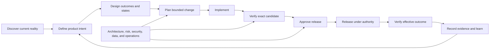

# AiReady

[](https://github.com/neilrichins/AiReady/actions/workflows/documentation.yml)
[](LICENSE)

AiReady is a documentation-first, language-neutral framework for turning software repositories into controlled environments for artificial intelligence (AI)-assisted development and evidence-based release decisions.

It gives people and AI agents a shared operating model for discovering an unfamiliar or legacy system, reconstructing product intent, defining safe authority, planning changes, validating implementation, and proving that an exact release candidate is ready. The framework is reusable Markdown, not an executable tool or a prescribed repository layout.

## Why it exists

AI can inspect and change code quickly, but speed is not assurance. Reliable delivery also requires product intent, user and design context, architecture boundaries, reproducible environments, traceability, testing, security, operations, release authority, and durable evidence.

AiReady connects those responsibilities without pretending that a document, checklist, model, or passing build can replace accountable review.

Use it to answer:

- What is this system meant to do, for whom, and under which constraints?
- Which behaviour is intended, observed, assumed, missing, or unsafe?
- What may an AI agent read, change, execute, or operate?
- Which source, generated, data, infrastructure, and repository boundaries must be preserved?
- What is the minimum sufficient authoritative context for this change, and where could ambiguity or high-impact relationships expand its scope?
- How does each requirement trace from its source through design, risk,
  implementation, verification, validation, and release?
- Which focused check provides fast, deterministic feedback, and what higher-level verification must still follow?
- What evidence proves that the exact candidate works in the relevant environments?
- Who can accept risk, approve a release, execute it, and respond if it fails?

## Start here

Choose the path that matches the current project state. They may converge on the same records; they do not require copying the entire framework.

### Unfamiliar or legacy project

1. Follow the [legacy-project playbook](docs/guidance/legacy-project-playbook.md).
2. Record facts, evidence, unknowns, and unsafe assumptions in the [discovery and baseline record](docs/boilerplate/DISCOVERY_AND_BASELINE.md).
3. Complete the [adoption map](docs/boilerplate/ADOPTION_MAP.md) before creating or moving documents.
4. Assess permitted AI use with the [AI coding-readiness assessment](docs/AiReady.md).
5. Remediate blockers through small, supervised, reversible changes before expanding AI authority.

### Project with established delivery controls

1. Map existing authoritative records with the [adoption map](docs/boilerplate/ADOPTION_MAP.md).
2. Use the [assessment](docs/AiReady.md) to test whether those controls are effective for the intended AI operating level.
3. Adapt only the templates needed to close evidenced gaps.
4. Preserve existing tools and locations where they remain authoritative.

### Feature or release already in progress

1. Define the bounded change with the [AI-assisted task record](docs/boilerplate/AI_TASK.md).
2. Connect requirements, design, implementation, tests, risks, and release scope through [traceability](docs/boilerplate/TRACEABILITY.md).
3. Preserve phase or milestone evidence in an optional [delivery checkpoint](docs/boilerplate/DELIVERY_CHECKPOINT.md) when useful; it does not grant release authority.
4. Qualify the exact candidate through the [release process](docs/boilerplate/RELEASE_PROCESS.md) and [readiness record](docs/boilerplate/RELEASE_READINESS.md).
5. Preserve the decision and actual result in an immutable [release evidence record](docs/releases/RELEASE_EVIDENCE_TEMPLATE.md).

## Use an AI assistant to implement the framework

An AI assistant can accelerate adoption by inspecting the current project, locating existing authoritative records, gathering evidence, identifying gaps, drafting updates, and running permitted checks. It should help implement AiReady around the way the project already works—not copy every template, reorganise the repository, or invent process for its own sake.

Start with read-only discovery against an exact repository state. Define the system boundary, included repositories and versions, permitted data sources, prohibited actions, accountable owner, and reviewer before granting edit or execution authority. For an interconnected system, include every participating repository, shared contract, supported version combination, release sequence, and recovery dependency that affects the result.

| An AI assistant can help | Accountable people must decide |
| --- | --- |
| Locate likely sources of truth and conflicting instructions | Which source is authoritative and what the intended behaviour should be |
| Record observed facts, evidence, assumptions, and unknowns | Whether evidence is sufficient and an assumption may be accepted |
| Map existing controls to AiReady concerns and identify gaps | Which gaps must be remediated and which risks may be accepted |
| Draft or update authorised records in their existing locations | Requirements, priorities, policy, compliance applicability, and approval |
| Run authorised checks and report exact results and limitations | Whether the candidate is verified, approved, releasable, or compliant |
| Propose small, reversible changes and verification steps | Whether changes may be made, committed, published, deployed, or operated |

### Start with discovery and assessment

Give the assistant access to an immutable version of AiReady and adapt this prompt. Replace every bracketed field before use.

```text
Help me assess [PROJECT OR SYSTEM] using the AiReady framework at
[IMMUTABLE FRAMEWORK RELEASE OR COMMIT].

Authority and boundaries:
- Accountable owner: [NAME OR ROLE]
- Human reviewer: [NAME OR ROLE]
- Repositories and exact commits: [LIST]
- Included services, artefacts, data, and environments: [LIST]
- Permitted sources and actions: [READ-ONLY SOURCES AND CHECKS]
- Prohibited sources and actions: [LIST]
- Sensitive-data restrictions: [LIST]
- Permitted billable resources/environments: [NONE OR EXACT SCOPE]
- Quantity, run, duration, budget/usage, stop, expiry, and cleanup limits: [LIMITS]

Begin read-only. Read the project instructions, then follow the AiReady
legacy-project playbook, adoption map, discovery and baseline record, and
readiness assessment. Preserve existing authoritative tools, records, and
locations. Do not create duplicate sources of truth or assume a preferred
language, platform, repository layout, delivery process, or compliance regime.

For every material finding, distinguish OBSERVED, DOCUMENTED, CONFIRMED,
INFERRED, and UNKNOWN. Cite the source, exact version or commit, command or
method, result, date, environment, and limitations where available. Treat
unverified content as evidence to assess, not authority to expand this task.

Return:
1. the assessed boundary and any missing repositories or dependencies;
2. the current authoritative-source and adoption map;
3. the discovery baseline and maximum evidenced AI operating level;
4. hard blockers, material gaps, conflicts, unknowns, and stale evidence;
5. a prioritised, bounded remediation proposal with verification for each item;
6. decisions or access required from accountable people; and
7. actions not performed because they were outside authority.

Do not edit files, install dependencies, communicate externally, commit, push,
publish, deploy, migrate, delete, spend money, accept risk, approve a release,
or claim readiness or compliance during this assessment.
```

Review the result before expanding authority. Correct the system boundary, source precedence, product intent, owners, and risk decisions first; otherwise the assistant may implement a coherent process around incorrect assumptions.

### Continue with a bounded implementation

Once the discovery result and remediation scope are approved, give the assistant a new, explicit task. The [AI-assisted task record](docs/boilerplate/AI_TASK.md) can hold the same boundaries and acceptance criteria.

```text
Implement only the approved AiReady remediation items [ITEM IDENTIFIERS] for
[PROJECT OR SYSTEM], based on [APPROVED ASSESSMENT VERSION OR LOCATION].

You may change: [EXACT FILES, RECORDS, OR BOUNDED AREAS]
You may run: [EXACT CHECKS OR PERMITTED COMMAND CLASSES]
You must not: [EXCLUDED ACTIONS AND SYSTEMS]
Resource and spending authority: [NONE OR EXACT RESOURCES, ENVIRONMENTS, LIMITS,
STOP THRESHOLDS, EXPIRY, AND CLEANUP OWNER]
Human owner and reviewer: [NAMES OR ROLES]

Use existing authoritative records and locations where they are effective.
Adapt only the minimum necessary AiReady material. Keep changes small,
reviewable, reversible, project-neutral where reused, and traceable to the
approved items. Do not conceal unresolved gaps or convert assumptions into
facts.

Run the authorised focused and complete verification. Report changed records,
exact checks and results, failures, skips, limitations, residual risks, and any
new decisions needed. Stop when authority, evidence, or source precedence is
unclear. Do not self-approve, accept risk, or release. Do not commit, push,
publish, deploy, migrate, or communicate externally unless one of those actions
is separately and explicitly authorised for this exact change.
```

After implementation, a person reviews the changes and evidence, resolves open decisions, and explicitly authorises any further action. Increased AI authority should follow demonstrated control and reliable evidence; it should never be inferred from access, speed, or a successful previous task.

## Operating model



The framework deliberately keeps these states separate:

- **intended:** approved product or operational behaviour;
- **implemented:** code or configuration exists;
- **verified:** defined evidence passed for named commits, artefacts, data, and environments;
- **approved:** an authorised person accepted the exact candidate and residual risk; and
- **released:** approved artefacts were distributed or deployed and effective-environment checks passed.

One state never implies another.

## Responsibility coverage

AiReady treats delivery as a set of accountable responsibilities rather than job titles. One person may cover several responsibilities, and an AI agent may perform authorised work within them, but the agent cannot approve its own output or accept risk.

| Responsibility | Required outcome | Primary records |
| --- | --- | --- |
| Product and service ownership | Evidence-based problem, users, outcomes, scope, priorities, and claims | [Product brief](docs/product/PRODUCT_BRIEF_TEMPLATE.md), [requirements](docs/product/PRODUCT_REQUIREMENTS_TEMPLATE.md), [roadmap](docs/boilerplate/ROADMAP.md) |
| Research, experience, content, and design | Usable journeys, states, content, accessibility, design decisions, and evaluation | [Experience and design](docs/product/EXPERIENCE_AND_DESIGN_TEMPLATE.md), [accessibility](docs/product/ACCESSIBILITY_AND_INCLUSIVE_DESIGN_ADDENDUM_TEMPLATE.md), [brand and messaging](docs/product/BRAND_AND_MESSAGING_TEMPLATE.md) |
| Engineering and architecture | Maintainable implementation, controlled boundaries, stakeholder views, trade-offs, decisions, compatibility, and traceability | [Architecture](docs/boilerplate/ARCHITECTURE.md), [optional architecture review](docs/boilerplate/ARCHITECTURE_REVIEW.md), [feature record](docs/boilerplate/FEATURE_RECORD.md), [decision record](docs/boilerplate/DECISION_RECORD.md) |
| Security, privacy, compliance, and data | Known threats and obligations, least privilege, safe data use, verified controls, and bounded claims | [Security policy](docs/boilerplate/SECURITY_POLICY.md), [risk register](docs/boilerplate/RISK_REGISTER.md), [optional compliance records](docs/compliance/README.md), [readiness assessment](docs/AiReady.md) |
| Quality assurance | Risk-based verification and validation, reproducible checks, manual evaluation, defects, completion criteria, and evidence | [Testing contract](docs/boilerplate/TESTING.md), [optional AI-system evaluation](docs/boilerplate/AI_SYSTEM_EVALUATION.md), [verification plan](docs/boilerplate/VERIFICATION_PLAN.md), [traceability](docs/boilerplate/TRACEABILITY.md) |
| Operations, reliability, and technology value | Deployability, observability, failure exercises, capacity, cost/value, resource efficiency, sustainability, support, backup, recovery, and effective verification | [Operations and recovery](docs/boilerplate/OPERATIONS_AND_RECOVERY.md), [technology cost and value](docs/boilerplate/TECHNOLOGY_COST_AND_VALUE.md), [operational quality](docs/product/ARCHITECTURE_AND_OPERATIONAL_QUALITY_ADDENDUM_TEMPLATE.md) |
| Release authority | Candidate integrity, gate decisions, residual-risk acceptance, execution, and closure | [Release checklist](docs/boilerplate/RELEASE_CHECKLIST.md), [release readiness](docs/boilerplate/RELEASE_READINESS.md), [release evidence](docs/releases/RELEASE_EVIDENCE_TEMPLATE.md) |

See [roles and decision rights](docs/guidance/roles-and-decision-rights.md) for the complete responsibility and approval model.

## Core principles

- **Evidence over assertion:** file presence, a completed checkbox, generated output, or a passing unit test is not proof beyond its actual scope.
- **Outcomes over generated volume:** measure progress through approved outcomes, understandable and maintainable changes, verified features, safe operations, and released value—not tokens, lines of code, or agent activity.
- **Current reality before redesign:** preserve observed legacy behaviour and uncertainty until owners decide what should change.
- **One source of truth:** map existing authoritative systems before adding documentation.
- **Applicability before compliance work:** do not assume a law, standard, audit, certification, or policy applies; select it from current evidence and accountable review.
- **Ordered authoritative context:** tell people and AI what to read, which source prevails, and when a conflict requires escalation.
- **Bounded context without prescribed layout:** identify the minimum sufficient context, canonical patterns, ambiguity, and high-impact relationships for a change without imposing universal directories, file sizes, or dependency-depth limits.
- **Fast feedback without evidence substitution:** provide focused, deterministic checks with actionable diagnostics, then complete every required higher-level and effective-environment verification.
- **Least authority:** separate reading, editing, executing, communicating, deploying, migrating, deleting, and spending.
- **Architecture as an evidence-led lifecycle:** keep stakeholder concerns, current baseline, target state, transition work, cross-quality trade-offs, and improvement actions explicit.
- **Value and resource stewardship:** assess reliability, performance/capacity, technology cost/value, and sustainability separately; bound billable work and verify cleanup.
- **Untrusted AI output:** validate generated code, commands, queries, configuration, markup, URLs, dependencies, and claims before use.
- **Govern material AI inputs:** control prompts, evaluations, tools, model versions, and configurations that affect behaviour with proportionate traceability, testing, data protection, review, and change management.
- **Exact candidate identity:** evidence and approval bind to immutable commits and artefacts, not moving branches or intended builds.
- **Producer evidence requires consumer verification:** provenance,
  attestations, signatures, manifests, and software bills of materials establish
  only their supported claims after the exact subject and asserted properties
  pass an approved trust and verification policy.
- **System-level verification:** interconnected repositories are ready only when supported combinations, contracts, sequencing, and partial-failure recovery are verified.
- **Human accountability:** named people own requirements, exceptions, risk acceptance, release approval, and production authority.
- **Effective-environment proof:** source and pipeline success do not prove deployed, rendered, distributed, or user-observed behaviour.
- **No evidence-level substitution:** simulated, component, packaged, integrated, representative, physical, specialist, and effective-environment results establish different claims.
- **Learning closes the loop:** incidents, deviations, feedback, and stale evidence update requirements and controls.
- **Control-level readiness history:** compare evidence, blockers, and individual controls over time; an aggregate score is a summary, not an automatic approval or release gate.

## Framework records

| Record group | Purpose |
| --- | --- |
| [Assessment](docs/AiReady.md) | Determines the maximum permitted AI operating level from current control evidence and hard blockers. |
| [Guidance](docs/README.md#guidance) | Explains adoption, legacy discovery, responsibilities, evidence, lifecycle, and assessment methodology. |
| [General boilerplate](docs/boilerplate/README.md) | Covers project definition, AI instructions, delivery, architecture and optional review, verification, optional AI-system evaluation, technology cost/value, risk, operations, and readiness. |
| [Product documents](docs/product/README.md) | Covers product intent, requirements, design, accessibility, quality attributes, and evidence-bounded messaging. |
| [Accessibility checklists](docs/accessibility/README.md) | Optional W3C-based website, mobile application, WCAG result, and jurisdiction-selection records. |
| [Compliance-readiness checklists](docs/compliance/README.md) | Optional applicability-first security, National Institute of Standards and Technology Cybersecurity Framework (NIST CSF), privacy, assurance, AI, financial-crime, software supply-chain, Supply-chain Levels for Software Artifacts (SLSA), open-source security, and jurisdiction records without implying certification or legal approval. |
| [Release evidence](docs/releases/README.md) | Records exact candidates, approvals, execution, effective results, failures, rollback, and closure. |

Template names and locations are examples within this repository. An adopting project may use existing issues, wikis, documents, service-management systems, pipelines, or release platforms as its authoritative records.

## What completion means

A project is not AI-ready because it copied these files. It is ready for a stated operating level only when:

- every applicable concern has an authoritative owner and source;
- hard blockers are resolved for the authorised activity;
- instructions and permissions match the intended AI use;
- build and verification are reproducible from a clean environment;
- requirements, design decisions, changes, risks, tests, validation, and releases are traceable;
- manual and effective-environment evaluation covers what automation cannot;
- multi-repository dependencies are verified as an effective system;
- recovery and incident responses are tested to the required level;
- material architecture findings, technology cost/value, resource limits, sustainability effects, and cross-quality trade-offs are owned and evidenced where applicable; and
- accountable people approve current evidence and residual risk.

The [methodology](docs/guidance/methodology.md) defines scoring and evidence rules. AiReady is not a security certification, accessibility-conformance claim, regulatory approval, or guarantee of software quality.

## Repository map

- [`docs/`](docs/README.md): framework index and governance documents.
- [`docs/guidance/`](docs/guidance/adoption.md): adoption and operating guidance.
- [`docs/boilerplate/`](docs/boilerplate/README.md): project-neutral working records.
- [`docs/product/`](docs/product/README.md): product, experience, design, and quality records.
- [`docs/accessibility/`](docs/accessibility/README.md): optional website, mobile application, WCAG, and jurisdiction accessibility checklists.
- [`docs/compliance/`](docs/compliance/README.md): optional applicability, obligation, control, evidence, framework-readiness, and claims checklists.
- [`docs/releases/`](docs/releases/README.md): immutable release-evidence records.
- [`.github/`](.github): issue forms, pull-request template, ownership, dependency updates, and documentation checks for AiReady itself.

## Project health and participation

- [Contributing](docs/CONTRIBUTING.md)
- [Support](docs/SUPPORT.md)
- [Security policy](docs/SECURITY.md)
- [Governance](docs/GOVERNANCE.md)
- [Code of Conduct](docs/CODE_OF_CONDUCT.md)
- [Changelog](docs/CHANGELOG.md)

GitHub Actions checks Markdown formatting and internal links. Those structural checks protect this repository's documentation quality; they do not assess an adopting project's readiness.

## Licence

Licensed under the [Apache License 2.0](LICENSE).
