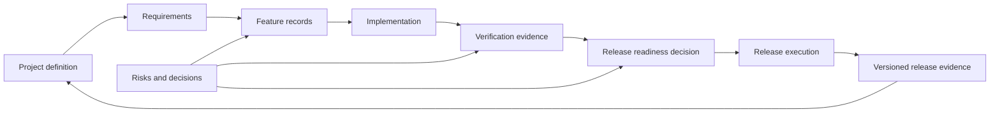

# AI Ready

AI Ready is a documentation-first, language-neutral framework for preparing software projects for controlled artificial intelligence (AI)-assisted development and evidence-based release decisions.

Its primary deliverables are reusable Markdown documents. They help developers and AI agents understand what a project is, what it must do, which features exist, what has actually been implemented and verified, what remains risky or unknown, and what evidence is required before a release can proceed.

The framework does not prescribe a programming language, build system, hosting model, test tool, or release platform. Each adopting project records its own commands and evidence in the Markdown templates.

## What the document framework manages

The framework deliberately keeps these states separate:

- **implemented:** code or configuration exists;
- **verified:** the defined evidence passed against named commits, artefacts, and environments; and
- **released:** the approved artefacts were distributed or deployed and post-release checks passed.

Implemented does not mean verified. Verified does not mean released.

## Core Markdown documents

| Document | Question answered | When updated |
| --- | --- | --- |
| [AI readiness assessment](docs/AiReady.md) | Is the repository controlled enough for the intended level of AI coding? | AI tool, authority, data, architecture, or control change |
| [Project definition](docs/boilerplate/PROJECT_DEFINITION.md) | What is the project, who owns it, and what constraints apply? | Scope, owner, environment, or obligation change |
| [Requirements register](docs/boilerplate/REQUIREMENTS.md) | What must the project demonstrably do? | Requirement or acceptance change |
| [Feature register](docs/boilerplate/FEATURE_REGISTER.md) | Which features exist and what are their implementation, verification, and release states? | Every feature-state change |
| [Feature record](docs/boilerplate/FEATURE_RECORD.md) | What outcome, boundaries, acceptance criteria, and evidence apply to one feature? | Throughout the feature lifecycle |
| [Roadmap](docs/boilerplate/ROADMAP.md) | Which outcomes are planned, in what order, and on which assumptions? | Planning or dependency change |
| [Traceability](docs/boilerplate/TRACEABILITY.md) | How do requirements connect to features, changes, tests, evidence, and releases? | Every material delivery change |
| [Verification plan](docs/boilerplate/VERIFICATION_PLAN.md) | What must be verified, how, where, by whom, and with what evidence? | Requirement, risk, test, or environment change |
| [Risk register](docs/boilerplate/RISK_REGISTER.md) | What could prevent the required outcome and who owns the response? | New risk, control failure, treatment, or review |
| [Project status](docs/boilerplate/PROJECT_STATUS.md) | What is the current evidence-based delivery position? | Agreed reporting interval |
| [Release process](docs/boilerplate/RELEASE_PROCESS.md) | How does a change progress from planned scope to a closed release? | Release-governance change |
| [Release checklist](docs/boilerplate/RELEASE_CHECKLIST.md) | Which checks and conditions must be completed for a release? | Release method or obligation change |
| [Release readiness](docs/boilerplate/RELEASE_READINESS.md) | Is this exact release candidate ready, and what evidence supports the decision? | Every release candidate |
| [Release evidence record](docs/releases/RELEASE_EVIDENCE_TEMPLATE.md) | What immutable evidence and result are retained for a release? | Once per candidate/release decision |

Supporting boilerplate covers AI-agent instructions, contribution rules, security, architecture, multi-repository coordination, testing, operations, decisions, task definition, change review, and ownership.

## Recommended adoption

### Start with the existing project

Complete the [adoption map](docs/boilerplate/ADOPTION_MAP.md) first. For each framework concern, identify the project's current authoritative document, system, or process. Reuse or improve it where practical. Create a new document only when the concern is genuinely missing.

The suggested minimum concerns are:

1. AI authority and repository instructions;
2. project purpose and ownership;
3. feature status;
4. verification coverage;
5. release process and checklist;
6. current release-candidate readiness; and
7. retained release evidence.

### Complete governed set

Use the full [boilerplate catalogue](docs/boilerplate/README.md) for projects with multiple teams or repositories, production operations, sensitive data, contractual obligations, migrations, accessibility requirements, or material security and recovery risks.

Review each placeholder. Delete genuinely irrelevant boilerplate or mark it `NOT APPLICABLE` with evidence. Do not keep statements that are not true.

## Release rule

A release is not ready merely because the build passes. Release approval requires:

- exact candidate commits and immutable artefacts;
- approved and traceable scope;
- current verification evidence for included features and applicable quality areas;
- resolved blockers and authorised, time-bounded accepted risks;
- compatible multi-repository/component versions where applicable;
- backup, migration, rollback, restore, monitoring, and support readiness;
- named human approval; and
- effective-environment verification after release.

## Manual adoption

Clone or download the repository and review the relevant boilerplate with the accountable project owners. Merge it into the project's existing documentation and work-management system, or store adapted copies wherever that project already keeps authoritative records.

Template file names and this repository's catalogue directories are suggestions only. They do not prescribe where an adopting project stores source code, tests, documentation, features, decisions, or release evidence.

The documents are deliberately manual to adopt: an owner must decide what applies, replace every placeholder, remove false assumptions, and identify missing evidence. Copying files is not readiness.

## Framework documentation

- [Documentation index](docs/README.md)
- [Adoption](docs/guidance/adoption.md)
- [Document lifecycle](docs/guidance/document-lifecycle.md)
- [AI coding-readiness methodology](docs/guidance/methodology.md)
- [Control catalogue](docs/guidance/control-catalogue.md)

See the complete [Markdown boilerplate catalogue](docs/boilerplate/README.md).

## Product and release examples

- [Product document examples](docs/product/README.md) cover product intent, requirements, brand and messaging, accessibility and inclusive design, architecture, and operational quality.
- [Release evidence examples](docs/releases/README.md) cover standard and hotfix release decisions, exact candidates, verification, execution, and closure.

These directories show coherent document groupings within AI Ready. Adopting projects may copy individual sections into their existing authoritative documents and systems; the directory names and locations are not requirements.

## Repository validation

GitHub Actions checks Markdown formatting and internal links. These checks protect document quality only. They do not determine whether an adopting project is AI-ready or whether a release is ready.

## Licence

Licensed under the [Apache License 2.0](LICENSE).
